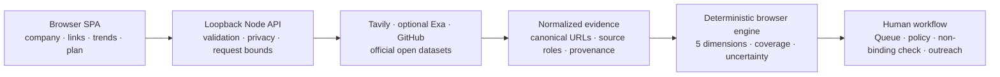

# Proofline

> Real startup discovery, cited opportunity scoring, and human-controlled investment workflows.

[](https://nodejs.org/)
[](#validation)
[](LICENSE)

Proofline turns public startup signals into an auditable evidence workflow. It can discover real companies and founders, investigate a submitted company or business plan, compare the opportunity with incumbent problems and academic research, and produce a cited score with explicit coverage and uncertainty.

The score is a ranking aid—not a probability of success, valuation, revenue forecast, or investment recommendation. Check outputs are non-binding and never reserve funds, authorize a transfer, or send outreach automatically.

[View the one-minute PowerPoint overview](docs/Proofline_One_Minute_Overview_v1.pptx)

## Why Proofline

Traditional startup screening can be fast but difficult to audit: sources are mixed together, missing evidence becomes invisible, and a single score can hide weak dimensions. Proofline keeps the reasoning inspectable:

- Real companies, founders, source URLs, and provider provenance are retained.
- Founder, Market, and Idea-vs-Market axes remain independent.
- Evidence Quality and Revenue Plausibility stay visible as supporting dimensions.
- Coverage, contradictions, missing criteria, and uncertainty accompany every score.
- Human review and policy gates remain separate from research and scoring.

## What it does

- Discovers startups from an investment thesis or selected internet trends.
- Investigates a startup, founders, website/social links, or an authorized PDF/DOCX business plan.
- Uses Tavily for live Search/Extract and optional Exa cross-validation.
- Adds GitHub repository activity as a discovery indicator—not investment evidence.
- Checks exact-name context in GLEIF, ClinicalTrials.gov, NIH RePORTER, and USAspending.
- Compares startup claims with incumbent operating pain and academic or technical research.
- Projects reviewed opportunities into Queue, policy screening, Team Activity, and user-controlled outreach.
- Supports a fixed USD 100,000 default check or optional risk-adjusted sizing.

## Architecture



The server protects provider keys, validates requests, parses authorized documents locally, and returns normalized unreviewed evidence. Pure browser-side domain modules calculate the provisional or reviewed score. A workflow label can never override evidence or policy gates.

See [Architecture](docs/ARCHITECTURE.md) for the data flow and trust boundaries.

## Stack

| Layer | Implementation |
|---|---|
| Frontend | Framework-free HTML, CSS, and browser ES modules |
| Backend | Node.js core HTTP server; no Express |
| Document parsing | `pdf-parse` and `mammoth`, executed locally |
| Live research | Tavily Search/Extract; optional Exa Search cross-check |
| Discovery context | GitHub Repository Search |
| Official open data | GLEIF, ClinicalTrials.gov, NIH RePORTER, USAspending |
| State | Browser `localStorage` for policy/saved trends; session-local Queue/check/outreach |
| Tests | Node's built-in `node:test` runner |

## Installation

### Prerequisites

- Node.js 20.16 or newer. Node 24 LTS is recommended.
- pnpm via Corepack.
- A Tavily API key for live web research.
- Optional Exa and GitHub tokens for cross-validation and higher GitHub API limits.

### Run locally

```bash
git clone https://github.com/mattin89/Proofline.git
cd Proofline
corepack enable
pnpm install --frozen-lockfile
cp .env.example .env
pnpm start
```

On Windows PowerShell, replace the copy command with:

```powershell
Copy-Item .env.example .env
```

Populate only the credentials you intend to use:

```dotenv
TAVILY_API=your_tavily_key
EXA_API=your_optional_exa_key
GITHUB_TOKEN=your_optional_least_privilege_token
PORT=4173
```

Open [http://127.0.0.1:4173](http://127.0.0.1:4173). Proofline binds to loopback only.

Do not put secrets in browser code, screenshots, issues, or commits. `.env` and `.env.*` are ignored; only the blank `.env.example` belongs in Git.

## One-minute demo

1. Open **Live research → Analyze a startup**.
2. Click **Load frozen $100K result**. This uses no Tavily or Exa credits.
3. Review the Emovo Care score, citations, coverage, uncertainty, contacts, and official-data context.
4. Click **Add to Queue**, open the case, and set **Policy screen eligible**.
5. Complete the named-reviewer rationale and required acknowledgements to record the non-binding check.
6. Refresh the page. Emovo disappears from Queue while the assessment remains ready to replay.

The deterministic demo uses nine reviewed public sources and produces a 62.1 Opportunity score, 85.1% criterion coverage, ±18 uncertainty, and a fixed-policy non-binding USD 100,000 result eligible for human review.

## Scoring boundary

Proofline calculates five cited dimensions:

1. Founder Execution
2. Market Pull
3. Product / Technical Fit
4. Evidence Quality
5. Revenue Plausibility

Source role, review status, topical fit, independence, freshness, contradictions, and missing criteria affect the evidence model. Popularity, prestige, protected traits, and unsupported claims are excluded. Official open-data observations sit beside the score and have no hidden scoring or check-sizing authority.

## Privacy and security

- Provider keys remain server-side.
- Full business-plan text remains local by default.
- Only sanitized plan keywords may guide web search, and only after explicit consent.
- URLs with credentials, localhost/private targets, and reserved IP ranges are rejected.
- Upload size, parser time, concurrency, rate, query, result, and link counts are bounded.
- Tavily/Exa duplicate URLs merge into one source rather than double-counting evidence.
- Public contact discovery never guesses private addresses or bypasses login controls.
- Every recorded check keeps `binding`, `fundsReserved`, and `transferAuthorized` set to `false`.

See [Security Policy](SECURITY.md) for responsible reporting.

## Validation

```bash
pnpm run check
pnpm test
```

Latest verified release result with Node 24.14.0:

- 26 test files
- 216 tests passed
- 0 failures, skips, cancellations, or todo items

The suite covers evidence independence, conservative scoring, provider failures, SSRF and upload guards, open-data exact matching, policy gates, Queue workflows, contacts, outreach, trend reuse, and the repeatable Emovo demo.

## Project structure

```text
Proofline/
├── src/                    browser UI, evidence, policy, Queue, trends, contacts
├── tests/                  deterministic unit and integration tests
├── scripts/                demo PDF generation and inspection helpers
├── output/pdf/             packaged public-source Emovo demo plan
├── docs/                   architecture and one-minute PowerPoint
├── server.mjs              loopback HTTP API and provider boundary
├── index.html              application entry point
└── package.json            commands, runtime requirements, dependencies
```

## Data and investment disclaimer

Public evidence can be incomplete, stale, duplicated, or wrong. A high score does not guarantee company quality, investment returns, regulatory approval, clinical efficacy, or revenue. Verify entity matches, source claims, contact channels, conflicts, legal status, cap table, valuation, and commercial data before relying on any result.

Proofline is research software. It does not provide legal, financial, medical, or investment advice.

## License

Proofline is available under the [MIT License](LICENSE). Copyright © 2026 Mario.
