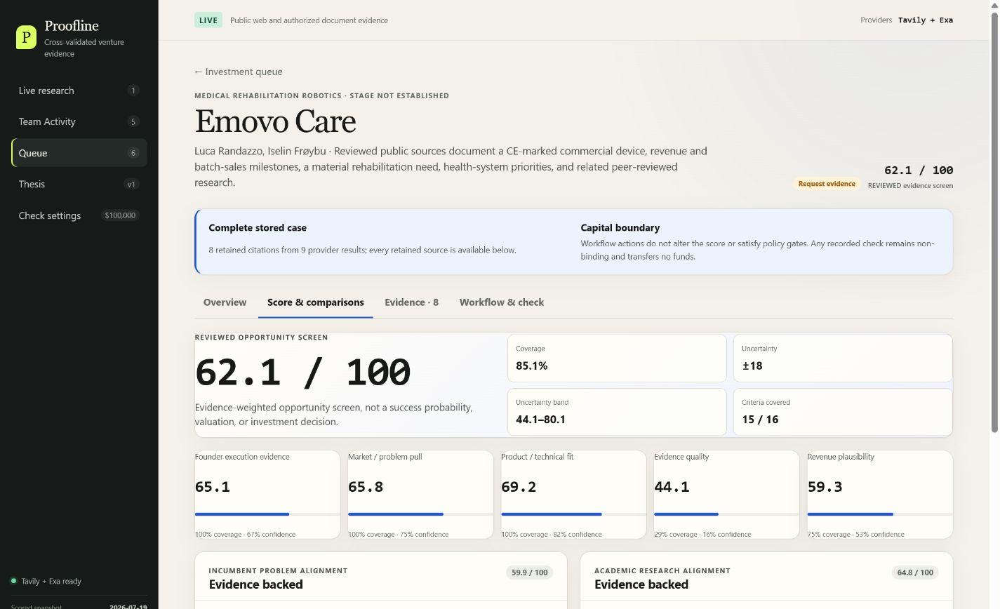
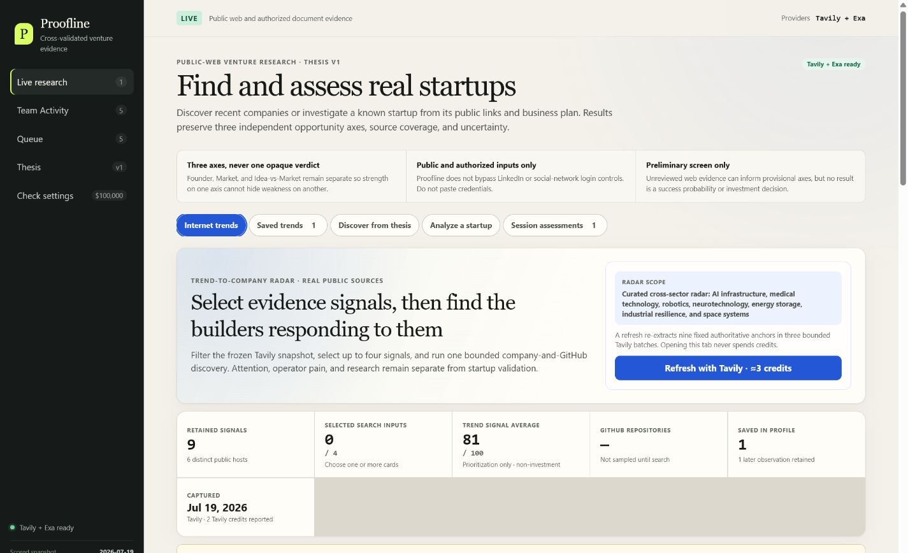
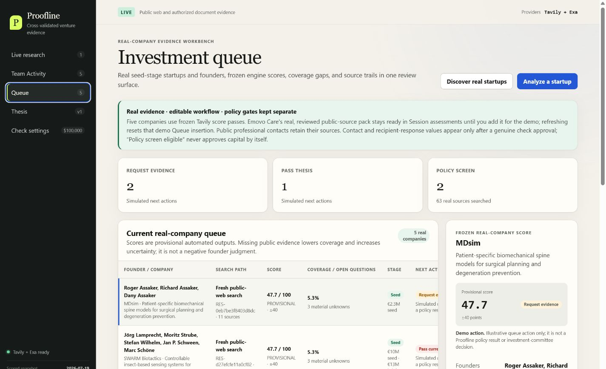
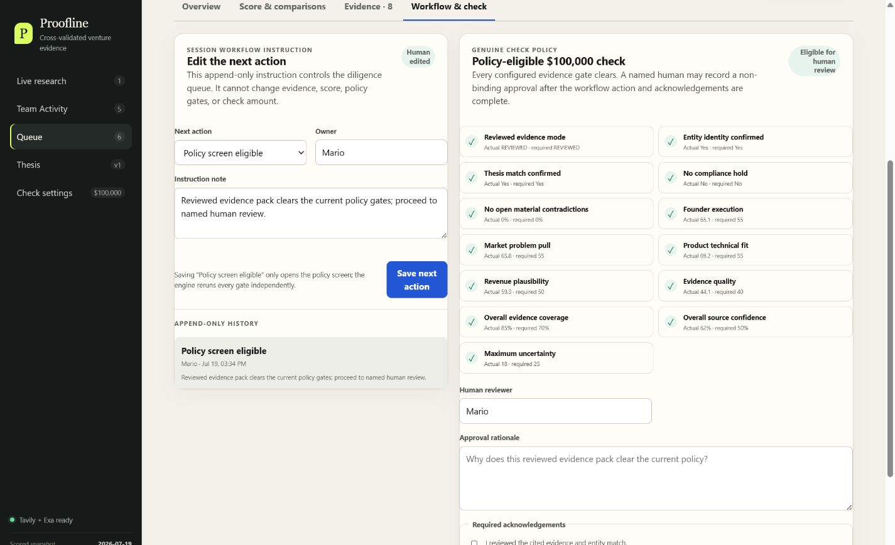
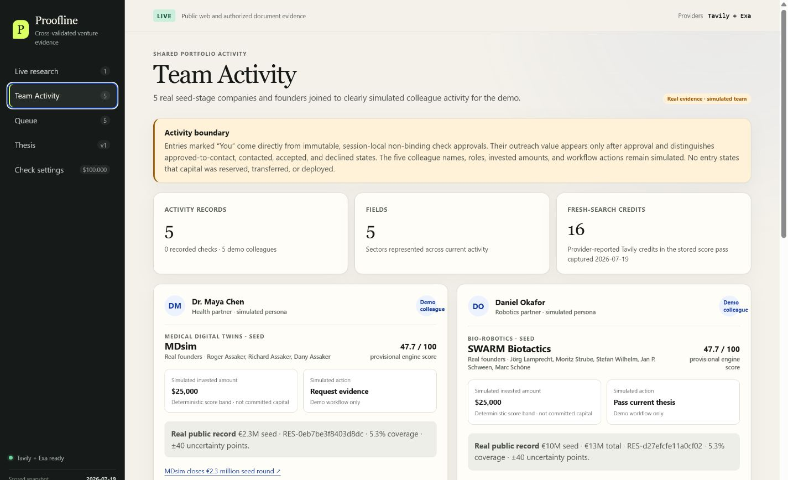
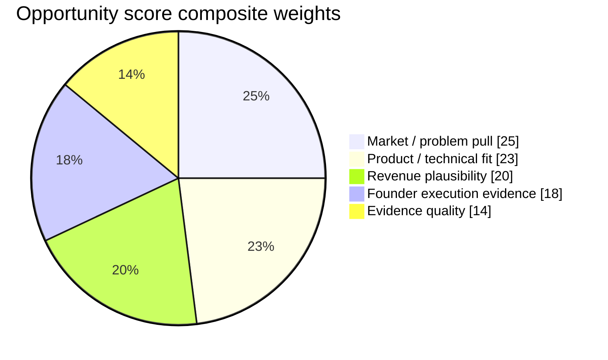
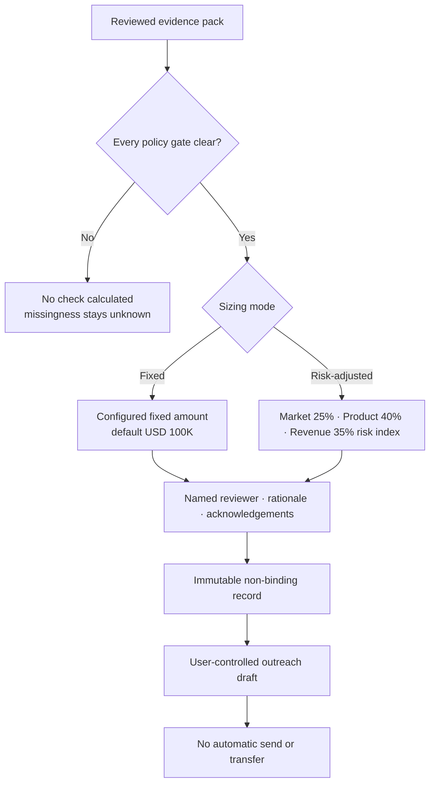
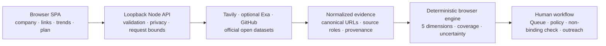

# Proofline

> Real startup discovery, cited opportunity scoring, and human-controlled investment workflows.

[](https://nodejs.org/)
[](#validation)
[](LICENSE)

Proofline turns public startup signals into an auditable evidence workflow. It can discover real companies and founders, investigate a submitted company or business plan, compare the opportunity with incumbent problems and academic research, and produce a cited score with explicit coverage and uncertainty.

The score is a ranking aid—not a probability of success, valuation, revenue forecast, or investment recommendation. Check outputs are non-binding and never reserve funds, authorize a transfer, or send outreach automatically.

[View the one-minute PowerPoint overview](docs/Proofline_One_Minute_Overview_v1.pptx)



_A reviewed real-source demonstration keeps the 62.1 Opportunity score, 85.1% weighted evidence coverage, ±18 uncertainty, all five dimensions, and comparator evidence visible together. It is a screening result—not a prediction or recommendation._

## Why Proofline matters

Early-stage evidence is fragmented across company websites, founder profiles, technical publications, public records, and fast-moving market signals. Conventional screening can collapse that uncertainty into a persuasive but unauditable number. Proofline makes the evidence chain inspectable: it retains citations and provenance, separates independent dimensions, exposes missing criteria and contradictions, and requires explicit human review before a non-binding check can be recorded.

| Common screening failure | Proofline response | Why it matters |
|---|---|---|
| Fragmented public evidence | One normalized, cited evidence ledger | Research can be reproduced, challenged, and refreshed |
| Opaque startup scores | Five visible dimensions plus coverage, confidence, and uncertainty | A headline score cannot conceal weak or missing evidence |
| Popularity mistaken for quality | Prestige, followers, likes, virality, and protected traits are excluded | Assessment stays focused on opportunity evidence |
| Repeated or copied sources | Canonical URL deduplication and independence groups | Provider overlap cannot become false corroboration |
| Missing data treated as failure | Missing criteria reduce coverage and raise uncertainty | Absence of public evidence does not become an adverse founder judgment |
| Premature capital automation | Separate policy gates and named human approval | Research software never silently becomes a funding decision |

## Product capabilities

| Capability | What Proofline does | Output | Boundary |
|---|---|---|---|
| Internet Trend Radar | Tracks authoritative signals across technology adoption, company challenges, and research frontiers | Selectable signals, region/sector filters, saved watches, and GitHub builder indicators | Trend attention does not score a startup |
| Thesis discovery | Searches public sources from sector, geography, stage, and thesis inputs | Real candidate and founder signals with retained source links | Candidates remain unreviewed until investigated |
| Startup investigation | Accepts company/founder names, public URLs, and authorized PDF, DOCX, or text plans | Normalized evidence pack, contacts, comparisons, and material unknowns | Uploaded plans remain self-reported evidence |
| Retrieval cross-validation | Uses Tavily and optional Exa, then canonicalizes shared URLs | Provider provenance without duplicate source credit | Provider overlap is retrieval corroboration—not an independent source |
| Opportunity scoring | Calculates five cited dimensions from a fixed rubric | Score, coverage, confidence, uncertainty, contradictions, and citations | Not a probability of success, valuation, or investment advice |
| Comparator intelligence | Matches startup evidence with incumbent pain and academic or technical research | Explicit comparison panels with source-level traces | Alignment does not prove product efficacy or adoption |
| Official open data | Checks exact entity matches in GLEIF, ClinicalTrials.gov, NIH RePORTER, and USAspending | Corporate, clinical, grant, and contract context | These observations remain outside the score and check sizing |
| Queue and checks | Applies editable workflow actions and fixed or risk-adjusted policy gates | Human-reviewable, immutable, non-binding check record | No funds are reserved, transferred, or promised |
| Public outreach | Retains sourced professional channels and prepares editable approval messages | User-controlled draft and contact/response history | Proofline never sends automatically or guesses private contacts |
| Saved trends | Stores explicit trend observations locally for reuse and comparison | Watchlist, later observations, and search reuse | Observed change is not a growth forecast |

## Product tour

### Internet Trend Radar

[](docs/images/proofline-trend-intelligence.png)

Real public-source signals, transparent non-investment trend scores, saved watches, filters, and GitHub-assisted builder discovery.

### Real-company Queue

[](docs/images/proofline-investment-queue.png)

Real seed-stage companies and founders retain scores, source counts, evidence gaps, uncertainty, and clearly labelled simulated workflow actions.

### Human-controlled policy workflow

[](docs/images/proofline-human-check-workflow.png)

Every dimension, coverage, confidence, identity, contradiction, and compliance gate must pass before a named reviewer can record a non-binding check. The screenshot shows a local demonstration state; the record remains non-binding.

### Team Activity

[](docs/images/proofline-team-activity.png)

Real startup facts remain separate from explicitly simulated demo colleagues, actions, and allocations; genuine approvals are projected from immutable check records.

## How Proofline scores an opportunity

Proofline scores an evidence-backed opportunity—not founder worth. The fixed, versioned rubric rejects caller-supplied weights and keeps four substantive evidence families plus Evidence Quality visible as five separate dimensions.

| Dimension | Composite weight | Criteria |
|---|---:|---|
| Founder execution evidence | 18% | Delivery record, learning velocity, evidence discipline, domain execution |
| Market / problem pull | 25% | Problem severity, buyer urgency, timing, incumbent pain |
| Product / technical fit | 23% | Feasibility, differentiation, independent validation, academic alignment |
| Evidence quality | 14% | Source quality, independence, and substantive coverage |
| Revenue plausibility | 20% | Willingness to pay, unit economics, sales path, market scale |



_These weights form the ranking composite. Check eligibility separately applies noncompensatory floors to every dimension._

### Evidence-to-score pipeline

```mermaid
flowchart LR
  A["Public web, authorized plan,<br/>founder and company links"] --> B["Normalize and deduplicate<br/>canonical URLs · source roles"]
  B --> C["Source quality<br/>reliability · directness · entity match · freshness"]
  C --> D["Independence gate<br/>coherent source-host groups"]
  D --> E["16 substantive criteria"]
  E --> F["Five weighted dimensions"]
  F --> G["Coverage and confidence"]
  F --> H["Opposing evidence and contradictions"]
  G --> I["Opportunity score<br/>plus uncertainty band"]
  H --> I
  I --> J["Separate policy gates"]
  J -->|Pass| K["Named human review"]
  J -->|Fail| L["Request more evidence"]
  K --> M["Immutable non-binding check"]
```



Key scoring behavior:

- Source quality starts with `45% reliability + 25% directness + 20% entity match + 10% freshness`, then applies review-state, source-type, staleness, upload, and retraction caps.
- Automated live criteria normally require at least two topically coherent source-host groups. Reviewed scoring additionally requires reviewed independent evidence.
- Only the strongest source in an independence group receives full credit; additional independent groups have diminishing returns.
- Supporting evidence moves a criterion from neutral toward the cited assessment; opposing evidence lowers score and confidence, and open contradictions add an explicit penalty.
- Missing criteria pull a dimension toward neutral while lowering coverage; they are not silently converted into negative claims.
- Provisional Opportunity scores are capped at 74 and always carry at least ±18 uncertainty.
- Coverage is criterion-weighted across the rubric, not a simple source count.

The uncertainty band is explicit:

```text
uncertainty points =
  8
  + 27 × (1 − coverage)
  + 15 × (1 − confidence)
  + 8 × contradiction pressure
```

The result is constrained to ±8–40 points. See [Scoring methodology](docs/SCORING.md) for the full rubric, source caps, claim formula, contradiction handling, and implementation references.

## From score to human decision

There is no single score threshold that approves a check. Proofline reruns every gate against the reviewed evidence pack:

| Required gate | Floor or state |
|---|---:|
| Evidence mode | `REVIEWED` |
| Entity identity and thesis match | Confirmed |
| Compliance hold / open material contradiction | None |
| Founder execution | ≥55 |
| Market / problem pull | ≥55 |
| Product / technical fit | ≥55 |
| Revenue plausibility | ≥50 |
| Evidence quality | ≥40 |
| Overall evidence coverage | ≥70% |
| Overall source confidence | ≥50% |
| Maximum uncertainty | ≤25 points |



The Opportunity score supports ranking; the policy engine controls eligibility. A strong dimension can raise the composite, but it cannot compensate for a weak or unknown gated dimension.

## Architecture



The server protects provider keys, validates requests, parses authorized documents locally, and returns normalized unreviewed evidence. Pure browser-side domain modules calculate the provisional or reviewed score. A workflow label can never override evidence or policy gates.

See [Architecture](docs/ARCHITECTURE.md) for the data flow and trust boundaries.

## Stack

| Layer | Implementation |
|---|---|
| Frontend | Framework-free HTML, CSS, and browser ES modules |
| Backend | Node.js core HTTP server; no Express |
| Document parsing | `pdf-parse` and `mammoth`, executed locally |
| Live research | Tavily Search/Extract; optional Exa Search cross-check |
| Discovery context | GitHub Repository Search |
| Official open data | GLEIF, ClinicalTrials.gov, NIH RePORTER, USAspending |
| State | Browser `localStorage` for policy/saved trends; session-local Queue/check/outreach |
| Tests | Node's built-in `node:test` runner |

## Installation

### Prerequisites

- Node.js 20.16 or newer. Node 24 LTS is recommended.
- pnpm via Corepack.
- A Tavily API key for live web research.
- Optional Exa and GitHub tokens for cross-validation and higher GitHub API limits.

### Run locally

```bash
git clone https://github.com/mattin89/Proofline.git
cd Proofline
corepack enable
pnpm install --frozen-lockfile
cp .env.example .env
pnpm start
```

On Windows PowerShell, replace the copy command with:

```powershell
Copy-Item .env.example .env
```

Populate only the credentials you intend to use:

```dotenv
TAVILY_API=your_tavily_key
EXA_API=your_optional_exa_key
GITHUB_TOKEN=your_optional_least_privilege_token
PORT=4173
```

Open [http://127.0.0.1:4173](http://127.0.0.1:4173). Proofline binds to loopback only.

Do not put secrets in browser code, screenshots, issues, or commits. `.env` and `.env.*` are ignored; only the blank `.env.example` belongs in Git.

## One-minute demo

1. Open **Live research → Analyze a startup**.
2. Click **Load frozen $100K result**. This uses no Tavily or Exa credits.
3. Review the Emovo Care score, citations, coverage, uncertainty, contacts, and official-data context.
4. Click **Add to Queue**, open the case, and set **Policy screen eligible**.
5. Complete the named-reviewer rationale and required acknowledgements to record the non-binding check.
6. Refresh the page. Emovo disappears from Queue while the assessment remains ready to replay.

The deterministic demo uses nine reviewed evidence records across eight unique public-source URLs and produces a 62.1 Opportunity score, 85.1% weighted evidence coverage (15/16 substantive criteria), ±18 uncertainty, and a fixed-policy non-binding USD 100,000 result eligible for human review.

## Privacy and security

- Provider keys remain server-side.
- Full business-plan text remains local by default.
- Only sanitized plan keywords may guide web search, and only after explicit consent.
- URLs with credentials, localhost/private targets, and reserved IP ranges are rejected.
- Upload size, parser time, concurrency, rate, query, result, and link counts are bounded.
- Tavily/Exa duplicate URLs merge into one source rather than double-counting evidence.
- Public contact discovery never guesses private addresses or bypasses login controls.
- Every recorded check keeps `binding`, `fundsReserved`, and `transferAuthorized` set to `false`.

See [Security Policy](SECURITY.md) for responsible reporting.

## Validation

```bash
pnpm run check
pnpm test
```

Latest verified release result with Node 24.14.0:

- 26 test files
- 216 tests passed
- 0 failures, skips, cancellations, or todo items

The suite covers evidence independence, conservative scoring, provider failures, SSRF and upload guards, open-data exact matching, policy gates, Queue workflows, contacts, outreach, trend reuse, and the repeatable Emovo demo.

## Project structure

```text
Proofline/
├── src/                    browser UI, evidence, policy, Queue, trends, contacts
├── tests/                  deterministic unit and integration tests
├── scripts/                demo PDF generation and inspection helpers
├── output/pdf/             packaged public-source Emovo demo plan
├── docs/                   architecture, scoring methodology, screenshots, and PowerPoint
├── server.mjs              loopback HTTP API and provider boundary
├── index.html              application entry point
└── package.json            commands, runtime requirements, dependencies
```

## Data and investment disclaimer

Public evidence can be incomplete, stale, duplicated, or wrong. A high score does not guarantee company quality, investment returns, regulatory approval, clinical efficacy, or revenue. Verify entity matches, source claims, contact channels, conflicts, legal status, cap table, valuation, and commercial data before relying on any result.

Proofline is research software. It does not provide legal, financial, medical, or investment advice.

## License

Proofline is available under the [MIT License](LICENSE). Copyright © 2026 Mario.
