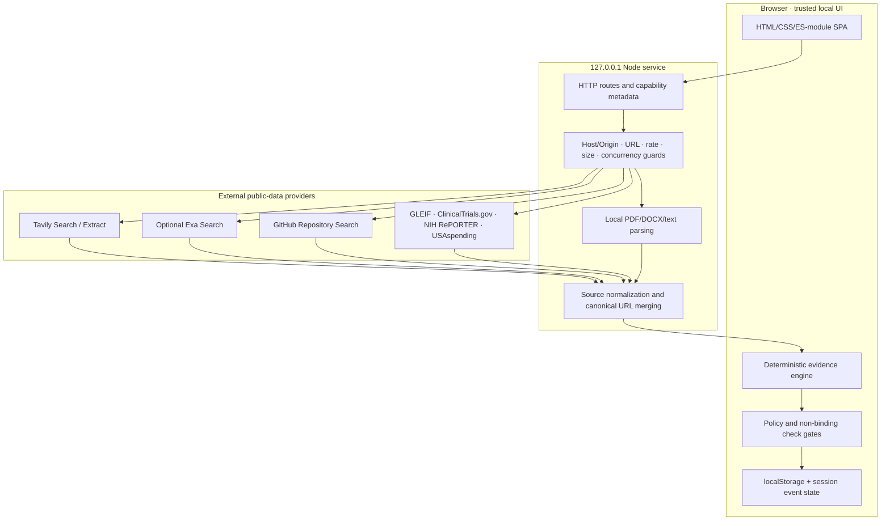

# Proofline architecture

Proofline deliberately separates retrieval, evidence interpretation, scoring, and capital-related actions. This prevents a provider result, workflow label, or UI state from silently becoming an investment decision.

## Runtime topology

## Request and evidence flow

1. The user supplies a thesis, selected trend IDs, company/founder identity, public URLs, context, or an authorized document.
2. The Node service rejects unknown fields and unsafe URLs before provider work.
3. Tavily performs primary retrieval. Exa is an explicit per-run cross-check; retrieval overlap does not create a second independent source.
4. GitHub contributes repository discovery indicators. Official datasets contribute exact-name context. Neither silently changes the Opportunity score.
5. Canonical URLs, provider observations, source roles, capture metadata, and access failures are normalized into an evidence ledger.
6. Browser-side pure domain modules calculate five dimensions, coverage, confidence, contradictions, and uncertainty.
7. Human review can move a case into Queue and policy screening. A check still requires a named reviewer, rationale, and explicit acknowledgements.
8. Outreach content is generated for the user; Proofline does not autonomously send it or infer delivery/recipient response.

## Trust boundaries

| Boundary | Enforced behavior |
|---|---|
| Provider credentials | Server-side only; capability responses reveal availability, never values |
| Public URLs | Credentialed, loopback, private, reserved, and non-HTTP(S) targets are rejected |
| Uploaded plans | Parsed locally; full text is not returned or sent to research providers |
| Plan-guided web search | At most eight sanitized keywords, only after explicit consent |
| Cross-provider overlap | Same canonical page counts once; provider observations remain traceable |
| Missing official records | Unknown—not zero, negative, or a fabricated risk signal |
| Workflow labels | Cannot mutate evidence, score, coverage, or policy gates |
| Check records | Always non-binding; no funds reserved or transfer authorized |
| Outreach | User-controlled; no autonomous send or inferred response |

## Core modules

| Module | Responsibility |
|---|---|
| `server.mjs` | Loopback HTTP service, provider orchestration, validation, SSRF/privacy/rate guards |
| `src/live-workspace.mjs` | Live research UI, intake, assessment rendering, trend and saved-trend workflows |
| `src/live-domain.mjs` | Evidence normalization, claim derivation, five dimensions, coverage, uncertainty |
| `src/investment-policy.mjs` | Fixed and dynamic non-binding check eligibility and sizing |
| `src/live-queue.mjs` | Queue events, next actions, immutable approval snapshots |
| `src/open-data-providers-v1.mjs` | Exact-name official dataset adapters and fail-open provider handling |
| `src/check-outreach-v1.mjs` | Editable approval notice and user-recorded contact/response events |

## State model

- Thesis, check policy, and saved-trend history use browser `localStorage`.
- Live assessments, Queue entries, approvals, and outreach events are session-local.
- Refresh intentionally resets the Emovo Queue workflow so the demonstration can be replayed.
- Frozen real-data fixtures preserve exact research IDs, timestamps, citations, score mode, and provider usage for deterministic testing.
